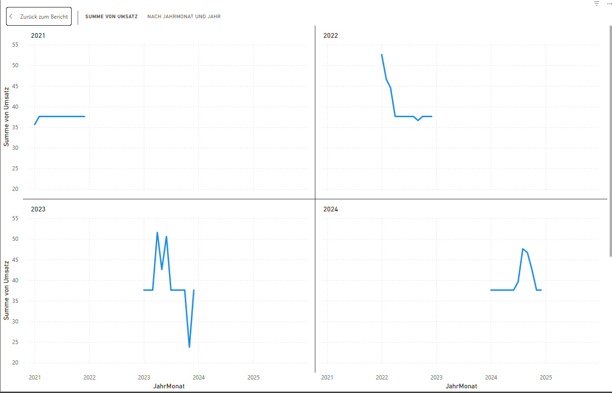
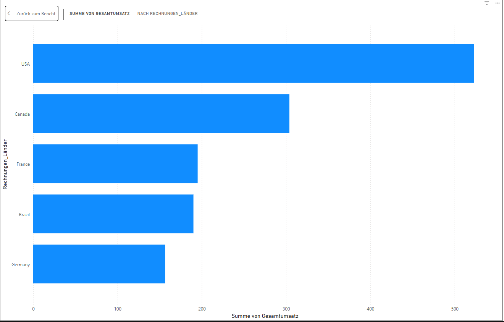

# Umsatzanalyse mit Power BI – Chinook Datenbank

## Projektübersicht

Das Projekt dient ausschließlich zu Übungszwecken und wurde am 07.06.2025 neu gestartet. Fragestellungen und Visualisierungen werden im Laufe der Zeit erweitert.

In diesem Projekt werden Rechnungs- und Kundendaten aus der Chinook-Probedatenbank analysiert. 
Ziel ist es, typische Aufgaben eines Business Analysts umzusetzen darunter die Umsatzentwicklung über Zeit sowie die Ermittlung der Top-Märkte nach Umsatz. 
Die Daten stammen aus einer PostgreSQL-Datenbank (ursprünglich aus der Open Source chinook-database)) und wurden über Power BI ausgewertet und visualisiert.


---

## Use Cases & Fragestellungen

1. **Wie entwickeln sich die Umsätze über die Monate und Jahre hinweg?**
2. **Welche Länder generieren den höchsten Umsatz (Top 5)?**
3. **siehe unter Erweiterungsideen**

---

## Umsetzung & Visualisierung

### 1. Umsatzentwicklung über Zeit (Small Multiples)

- Erstellung einer neuen Datumsspalte `JahrMonat` im Datumsformat 
- Aggregation des Umsatzes pro Monat
- Erstellung einer `Jahr`-Spalte zur Gruppierung
- Visualisierung: Liniendiagramm mit Small Multiples (1 Diagramm pro Jahr)

Diagrammaufbau:
- X-Achse: `JahrMonat`
- Y-Achse: Umsatz pro Monat (SUM)
- Small Multiple: Jahr



---

### 2. Top 5 Länder nach Umsatz

- Gruppierung der Rechnungsbeträge nach `Billing_Country`
- Aggregation der Summe von `total`
- Sortierung und Filterung auf die 5 umsatzstärksten Länder
- Visualisierung: gestapeltes Balkendiagramm

Diagrammaufbau:
- X-Achse: Umsatz (SUM)
- Y-Achse: `BillingCountry` (Rechnungen_Länder genannt)
- Filter: TopN 5 Länder nach Umsatz



---

## DAX-Funktionen

```dax

-- 1. Neue Tabelle mit nur 2 Spalten Land und Gesamtumsatz erstellen
LänderUmsatz = SUMMARIZE('public invoice', 'public invoice'[billing_country],"Umsatz", SUM('public invoice'[total]))

-- 2. JahrMonat aus Rechnungsdatum erzeugen
JahrMonat = DATE(YEAR('public invoice'[invoice_date]), MONTH('public invoice'[invoice_date]), 1)

-- 3.. Aggregation: Umsatz pro Monat
MonatsUmsatz = 
SUMMARIZE(
    'public invoice', 
    'public invoice'[JahrMonat],
    "Umsatz", SUM('public invoice'[total])
)

-- 4. Neue Jahr-Spalte für Gruppierung hinzufügen
Jahr = YEAR('MonatsUmsatz'[JahrMonat])
```

## Datenquelle

- Quelle: Chinook PostgreSQL Open Source Probedatenbank
- Tools:
  - PostgreSQL (pgAdmin 4)
  - Power BI + DAX
- Verwendete Tabellen:
  - public invoice
  - MonatsUmsatz
  - LänderUmsatz
- Erste SQL-Auswertungen zur Datenvalidierung und Exploration:
  - Dabei wurden einfache Aggregationen mittels COUNT, GROUP BY und DISTINCT durchgeführt, um z. B. die Kundenzahl, Länderverteilung und Umsatzverteilung zu prüfen.
  - siehe  [erste_abfragen.sql](./sql/countabfragen_mit_groupby_distinct.sql)

## Learnings

- Verbindung PostgreSQL mit Power BI
- Aggregationen, Gruppierungen und DAX-Verarbeitung
- Visualisierung zeitlicher Entwicklungen
- Filter- und Sortierlogiken für Business-Analysen
- Erstellung kleiner Hilfstabellen zur Auswertung

## Erweiterungsideen

- Vetriebsanalyse nach Mitarbeiter + Genrespezifisch
    - "„Welche Sales-Mitarbeiter haben den meisten Umsatz betreut?“ 
    - „Welcher Mitarbeiter verkauft welche Genres am erfolgreichsten?“
- Top-Produkte je Genre
    - „Was sind die meistverkauften Tracks im Genre Pop?“
- Umsatzanalyse nach Künstler, Genre oder Album
- Datenbank selber erweitern mit simulierten Rückgabequoten, um folgende Fragen/Aussagen zu untersuchen:
    - "Wie hoch ist die Rückgabequote pro Produkt?" 
    - "Produkt X wird zwar oft gekauft, aber mit 20 % Rückgabequote."
    - "Wenn der Kunde Artikel A kauft, hat er eine 75 %-Wahrscheinlichkeit, Artikel B auch zu kaufen."
    -> Cross Selling: "Käufer von Jazz kaufen oft auch Blues. Wie können wir das nutzen?“  
- Kundenwertanalyse
    - „Welche Kunden haben den höchsten Gesamtumsatz generiert?“ -> Clustering nach Ländern
- Geografische Analyse
    - Kartenvisualisierung mit Power BI (bubbles/ heatmap) -> Woher kommen unsere Kunden überhaupt? 
- Durchschnittlicher Warenkorbwert pro Kunde oder Land
- Wachstum zum Vormonat/ Quartal


## Autor

- Name: [Samet Taskin]
- Studium: Wirtschaftsinformatik (B.Sc.)
- Zielrolle: Business Analyst, Data Analyst
- Technologien: Power BI, DAX, PostgreSQL
